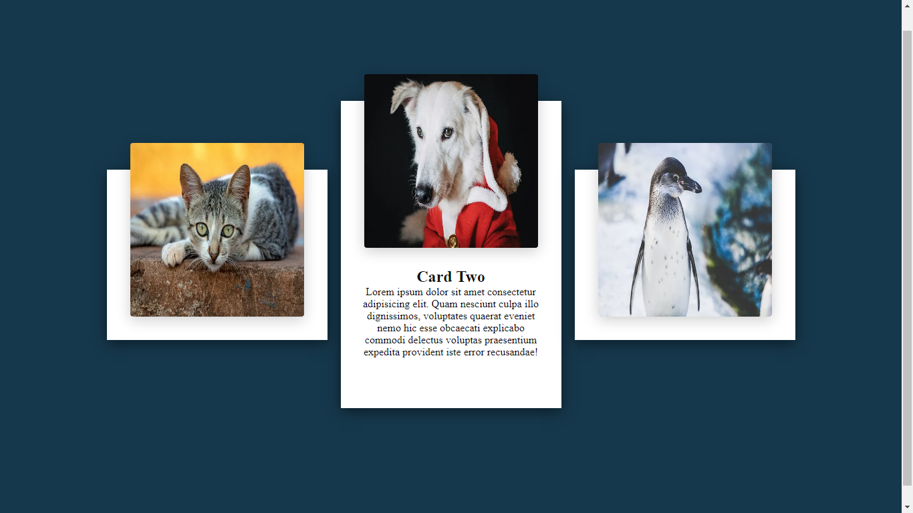

<h1 align="center">
    
</h1>

  

###  Sobre

**Card efeito hover**: Aprendendo a usar o hover css. Quando você passa o mouse em cima do card, ele muda de tamanho e aparece o texto.

---
 
### 💻 Tecnologia utilizada

- HTML 5
- CSS 3

---
